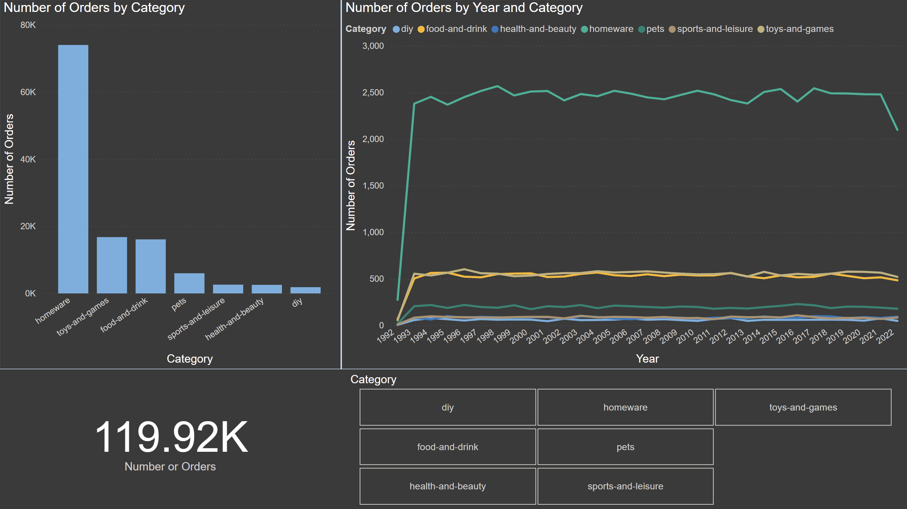
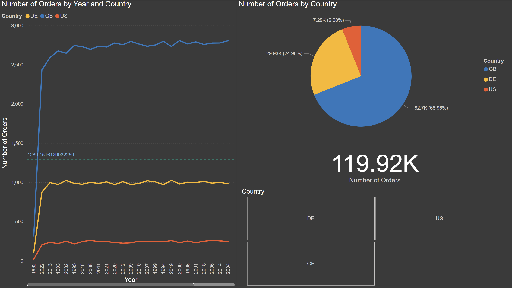

# Multinational Retail Data Centralisation

In this project I will act as an employee for a multinational company  that sells various goods across the globe.

Currently, their sales data is spread across many different data sources making it not easily accesible or analysable by current members of the team. 

In an effort to become more data-driven the organisation would like to make its sales data accessible from one centralised location.

My first goal will be to produce a system that stores the current company data in a database so it's accessed from one centralised location and acts as a single source of trust for sales data. 

I will then query the database to get up-to-date metrics for business. 

## Milestone 1 

- Creates a remote github repository for this project to version control the software.

- Connects the remote repository to a local clone using the command line.

```bash
git clone git clone https://github.com/d4min/multinational-retail-data-centralisation.git
```

## Milestone 2 Task 1, 2, 3

- Set up a database 'sales_data' within pgadmin4. This database will store all the company information once I extract it from various data sources. 

- Initialised the three classes which will be used in this project in three seperate python scripts: 

    1. The DataExtractor class will be responsible for methods used to extract data from the data sources. The sources will include a  CSV file, an API and an S3 bucket.

    1. The DatabaseConnector class which will be used to connect to the database and upload the cleaned data ready for analysis.

    1. The DataCleaning class which will include methods to clean the data from the various sources .

- Created the following methods in the DatabaseConnector class which will be used to connect and retrieve data from the AWS database:

    1. read_db_creds(): read the AWS database credentials from a YAML file and return a python dictionary of said credentials. 

    1. init_db_engine(): uses the read_db_cred() method to retrieve database credentials and uses these to initialise and return a SQLalchemy engine cononecting to the database.

    1. list_db_tables(): lists the tables present in the AWS database.

    1. upload_to_db(): takes in a pandas dataframe and table name and uploads them to the local sales_db database setup within pgadmin4

- Created the following method in the DatabaseExtractor class: 

    1. read_rds_table(): extracts the database table to a pandas dataframe. 

- Created the following method in the DataCleaning class:

    1. clean_user_data(): performs the cleaning of the user data. Taking into consideration NULL values, errors with dates, incomplete rows and rows filled with the wrong information.

## Milestone 2 Task 4

- Created the method 'retrieve_pdf_data' in the DataExtractor class which uses the tabula-py library to extract data from a pdf file into a pandas dataframe. 

```python
def retrive_pdf_data(self, link):

        table = tabula.read_pdf(link, pages='all')
        table_df = pd.concat(table)

        return table_df
```
- Created the method 'clean_card_details' in the DataCleaning class to clean the card details data so it is ready to be uploaded to the postgres database.

- Used the upload_to_db method in the DatabaseConnector class to store the cleaned card details in the postgres database

```python
def upload_to_db(self, df, table_name):
        
        # uses read_db_creds method to read the sales_data database credentials
        db_creds = self.read_db_creds('sales_data_creds.yaml')

        engine = create_engine(f"postgresql+psycopg2://{db_creds['RDS_USER']}:{db_creds['RDS_PASSWORD']}@{db_creds['RDS_HOST']}:{db_creds['RDS_PORT']}/{db_creds['RDS_DATABASE']}")
        df.to_sql(table_name, engine, if_exists='replace', index=False, index_label='index')

db_connect = DatabaseConnector()
db_connect.upload_to_db(table, 'dim_card_details)
```
## Milestone 2 Task 5

Task 5 is concerned with retrieving the store data through the use of an API, cleaning and storing it in the postgres database.

- Created the method 'list_number_of_stores' in the DataExtractor class which sends a GET request to the endpoint storing the number of stores there are. Through this I will know how many stores need to be extracted from the API.

```python
def list_number_of_stores(self, endpoint):

    url = endpoint 

    # reads in the x-api-key needed for authorisation and saves it as 'headers' which will be sent with the request
    connect = DatabaseConnector()
    headers = connect.read_db_creds('api_key.yaml')

    response = requests.get(url, headers=headers)

    data = response.json()
    number_of_stores = data['number_stores']

    return number_of_stores
```

- Defined the method 'retrieve_store_data' in the same class which uses a for loop to first change the {store_number} parameter in the API endpoint to the required store index and then retrieves it. 

- Each store is stored in the store_details list as a dictionary, this is then used to create a pandas dataframe. 

```python
def retrieve_stores_data(self, endpoint):

    url = endpoint

    connect = DatabaseConnector()
    headers = connect.read_db_creds('api_key.yaml')

    # calls the list_number_of_stores method to retrieve the amount of stores 
    number_of_stores = self.list_number_of_stores('https://aqj7u5id95.execute-api.eu-west-1.amazonaws.com/prod/number_stores')

    # empty list which will store each of the store details as a dictionory. This will be used to create the dataframe
    stores_list = []

    # sends a get request for each store 
    for i in range(number_of_stores):
        
        # replaces the parameter '{store_number}' for i which is a store index
        new_url = url.replace('{store_number}', str(i))
        response = requests.get(new_url, headers=headers)
        data = response.json() 
        stores_list.append(data)

    # creates a pandas dataframe from the list of dictionaries storing store details 
    store_data_df = pd.DataFrame(stores_list)

    return store_data_df
```
- Created the method clean_store_details in the DataCleaning class which cleans the store details and uploads the clean pandas dataframe to postgres

```python
# sets the index of the pandas dataframe 
table.set_index('index', inplace=True)

# removes 'lat' column which is not needed and is only filled with null values 
table.drop('lat', axis=1, inplace=True)

# some of the values in the continent column have an error where they begin with 'ee' but are otherwise correct. This removes the 'ee' substring from those rows. 
table['continent'] = table['continent'].str.replace('ee', '')

# changes 'country_code', 'continent' and 'store_type' columns data type to category
table['country_code'] = table['country_code'].astype('category')
table['continent'] = table['continent'].astype('category')
table['store_type'] = table['store_type'].astype('category')

# Defines a set of valid country codes and removes rows where the column entry does not match these. This removes rows filled with null values and incorrect data. 
country_codes = {'GB', 'US', 'DE'}
inconsistent_categories = set(table['country_code']) - country_codes
inconsistent_rows = table['country_code'].isin(inconsistent_categories)
table = table[~inconsistent_rows]   

# removes any alphabetical characters from rows in the staff_numbers column using a regular expression so they are ready to be converted to data type int
table['staff_numbers'] = table['staff_numbers'].str.replace(r"[a-zA-z]", '')

# changes the staff_numbers data type to numberic so it can used for calculations
table['staff_numbers'] = pd.to_numeric(table['staff_numbers'])

# uses to_datetime() method to correct date entries in the opening_date column and changes the column data type to datetime
table['opening_date'] = pd.to_datetime(table['opening_date'], infer_datetime_format=True, errors='coerce')
table['opening_date'] = table['opening_date'].astype('datetime64[ns]')
# removes timestamp from column as only the date is required 
table['opening_date'] = table['opening_date'].dt.date
```
## Milestone 2 Task 6

Task 6 works on retrieving the product data which is stored in a csv file in an aws s3 bucket. 

- Created the method 'extract_from_s3()' in the DataExtractor class which uses the boto3 library to download the csv file stored in an s3 bucket and then convert it to a pandas dataframe ready for cleaning. 

- For this step there were two methods required for the cleaning of product data: 'convert_product_weights()' as well as the normal 'clean_product_data()'. This is due to the product weights being stored in several different types of units e.g. kg, g, ml. These needed to be converted to kg and stored as floats so they can be used in calculations. 

    - There were several steps pertaining to converting the product weights. The first course of action was to deal with the multipack product weights which were stored in a different format from the rest: '12 x 100g'. These entries needed to first be multiplied to get the total product weight and then converted to kg. This was done using an if statement. 


    ```python
    if 'x' in value:

        x_index = value.index('x')
        value = value.replace('g', '')
        # uses string slicing to isolate the two integers which need to be multiplied
        value = int(value[:x_index - 1]) * int(value[x_index + 2:])
        value = float(value) / 1000
    ```

    - After multipack items were dealt with it was just a case of removing the units from entries and converting all of them to kg. Which was done in a similar manner to above where the string method .replace() was used to remove unit and then float(value) / 1000 to convert to the grams and millileter values to kg. Before passing these values through another if statement it was necessary to use a regular expression to remove some erroneous spacing between the values which was causing an error and not allowing the entries to be treated as float values, for example, there was a value stored as '77   .'


    ```python
    value = re.sub('[^0123456789\.kgml]', '', value)
    ```


    - Lastly all of the values in the 'weight' column were stored as floats


    ```python
    table['weight'] = table['weight'].astype(float)
    ```

- With the weight column in the table now in the correct format, the 'clean_products_data()' dealt with any remaining cleaning required such as removing null and incorrect rows and changing the column datatypes to the correct type e.g. category, datetime.

- After all cleaning tasks were complete the table is uploaded to postgres. 

 ## Milestone 2 Task 7 and 8

 The last two steps of milestone 2 extract and clean two more tables: the orders_table which contains information about all orders the company has made in the past; the date_times table which includes information about the data and time of these orders. The orders_table is stored in an AWS relational database, this is extracted using the read_rds_table method developed during step 2 and then cleaned. The date_times data is stored as a json file stored in an s3 bucket, this is extracted using the read_json() method from the pandas library

 ```python
table = pd.read_json('https://data-handling-public.s3.eu-west-1.amazonaws.com/date_details.json')
```

## Milestone 3

In this step I focused on developing the star based schema of the database and ensuring all columns are of the correct data types to ensure efficient and robust querying. 

- The ALTER TABLE sql keyword was used to make changes to the column data types in each table

    ```sql
        ALTER TABLE {table_name}
        ALTER COLUMN {column_name} TYPE {type};
    ```
    The data types used in the database include: UUID; VARCHAR(); SMALLINT and DATE

- In the dim_products table I added an additional column weight_class which provides a human readable weight class value to quickly classify a products weight. This is useful for when deciding the best delivery methods for said product. 

    First I created the new column in the dim_products table:

    ```sql
        ALTER TABLE dim_products
            ADD COLUMN IF NOT EXISTS weight_class VARCHAR(14);
    ```

    After the column was created I populated it using an UPDATE statement:

    ```sql
        UPDATE 
            dim_products
        SET
            weight_class = (
                CASE WHEN 
                    weight  < 2 THEN 'Light'
                WHEN
                    weight >= 2 AND weight < 40 THEN 'Mid_Sized'
                WHEN 
                    weight >= 40 AND weight < 140 THEN 'Heavy'
                ELSE
                    'Truck_Required'
                END)
            );
    ```

    I used the CASE WHEN operator in sql which acts similar to an if statement to check the weight and then issue an appropriate classification.

    The product_price column in the dim_products table also needed to be ammended to remove the '£' sign from all the values so the column type to be changed to float for calculations. This was done using an update statement.

    ```sql
        UPDATE 
            dim_products
        SET
            product_price = REPLACE(product_price, '£', '')
    ```
    
    I also updated the 'removed' column, replacing the values to True and False instead of still_available and removed. 

- After all the table columns have been cast to the appropriate data types the next step is to create the primary and foreign key relationships between the tables. 

    The orders_table acts as the central table in our schema which is referenced by each of the dim tables. To achieve this I set the relevant columns in each of the dim tables as the primary key. 

    ```sql
        ALTER TABLE {table_name}
        ADD PRIMARY KEY {primary_key}
    ```

    After the primary keys have been set up in each of the dim tables, the orders_table has to be updated to set the foreign keys. 

    ```sql
        ALTER TABLE orders_table
        ADD FOREIGN KEY {key} REFERENCES {table_name({key})}
    ```

## Milestone 4

Milestone 4 is concerned with querying the database we have constructed to extract useful data for business decisions. During this step I used SQL to query the database. 

Some of the key SQL functions and tools I used to achieve this are listed below:

- I used aggregation functions such as COUNT() and SUM() to work out things such as how many sales the company has made and the total amount of these sales.

```sql
SELECT country_code, 
    COUNT(store_code) AS total_no_stores
FROM 
    dim_store_details
GROUP BY 
    country_code
ORDER BY 
    total_no_stores DESC;
```

In the above query used the COUNT() function to ascertain the amount of stores the company has in different countries. 

- Another tool I used a lot during my queries were SQL Joins to connect multiple tables together to be able to use them in my queries. 

```sql
SELECT 
    SUM(product_quantity * product_price) AS total_sales, 
    month
FROM   
    orders_table
INNER JOIN
    dim_products ON orders_table.product_code = dim_products.product_code
INNER JOIN 
    dim_date_times ON orders_table.date_uuid = dim_date_times.date_uuid
GROUP BY
    month
ORDER BY 
    total_sales DESC;
```

The query above demonstrates the use of joins where I joined the orders_table with the dim_products and dim_date_times table to be able to ascertain which months produced the largest amount of sales. 

- I also used subqueries, which were especially useful when trying to calculate the percentage of sales that came through each type of store in the business. 

```sql
SELECT
    store_type,
    ROUND(SUM(product_price * product_quantity)::numeric, 2) AS total_sales,

    ROUND((SUM(product_quantity * product_price) * 100)::numeric / (
        SELECT
            SUM(product_quantity * product_price)
        FROM 
            orders_table
        INNER JOIN
            dim_products ON orders_table.product_code = dim_products.product_code
    )::numeric, 2) AS Percentage

FROM
    orders_table
INNER JOIN
    dim_products ON orders_table.product_code = dim_products.product_code
INNER JOIN
    dim_store_details ON orders_table.store_code = dim_store_details.store_code
GROUP BY 
    store_type
ORDER BY 
    total_sales DESC;
```

Here you can see the use of a subquery in the third SELECT statement to retrieve the total sum of sales. This is then used to divide the sum of sales grouped by store type to get the percentage of sales by store type. 

- Lastly I used Common Table Expressions (CTE) to make more complex queries. 

```sql
WITH next_sale AS(
SELECT date_uuid, 
	make_date(year::int, month::int, day::int) + timestamp AS sale,
	LEAD(make_date(year::int, month::int, day::int) + timestamp)
	OVER( ORDER BY make_date(year::int, month::int, day::int) + timestamp) AS next_sale
FROM dim_date_times)

SELECT
	year, 
	AVG(next_sale - sale) AS actual_time_taken
FROM 
	next_sale
INNER JOIN 
	dim_date_times ON next_sale.date_uuid = dim_date_times.date_uuid
GROUP BY 
	year
ORDER BY 
	actual_time_taken DESC
LIMIT 5;
```
As you cannot apply aggregate functions to window functions it was necessary to construct a CTE which retrieves a column of the sale times as a timestamp and a column for the next sale times. I can then do a SELECT statement on the CTE to calculate the average time between each sale.

The entirety of the SQL queries can be found in the sales_data_queries.sql file within this repository. The results of the query are available within the images/SQL Queries folder. 

## Power BI Visualisations

With all of the retail business' data available in a centralised location it is now easier than ever to construct visualisations for stakeholders to use during decision making. 

These visualisations allow us to transform the thousands of rows of data in our table into graphs and other visualisations that management can use to quickly analyse. 



The above visualisation makes use of 4 different visualisation tools within PowerBI to present the number of orders in relation to the category of the order. 

- Bar Chart: To clearly display the difference in number of orders depending on the category of product.

- Line Graph: To showcase the change year to year of the orders each category has generated.

- Card: To display the number of orders. 

- Slicer: To filter the visualisations based upon a specific product category. 


Here we make use of the slicer to see the number of orders for the 'Pets' product category. 


This visualisation uses a map as the main focus point to visually show the distribution of stores around the world the retailer has. This is useful for being able to quickly see the locations and regions where most stores have been opened and also the places where the business hasn't focused as much. 

- Map: Showcases the distribution of stores, the bubble size is representative of number of orders that store has generated. 

- Table: Allows us to view specific store addresses and the number of orders they have generated.

- Slicer: Lets us segment the visualisations by country code. 

- Card: Displays the number of orders. 


Here we have used the slicer to segment the visualisations to only show us the stores present in Great Britain. We can see from the map visual quickly which of the stores in London generates the most orders. 




In the final visualisation we have presented the number of orders the store has generated within each of the countries it has a presence in. 

- Line Graph: To showcase how the number of orders in relation to country has changed over the years the company has been active. Also includes an average line (the dotted line) which tells us the average orders generated.

- Pie Chart: Visually show the portion in percentage each region holds of the total number of orders. 

- Card: Display the number of orders.

- Slicer: To segment the visualisations based on a specific country. 


Here we have segmented the visualisations to only display information about the orders in the US. 

